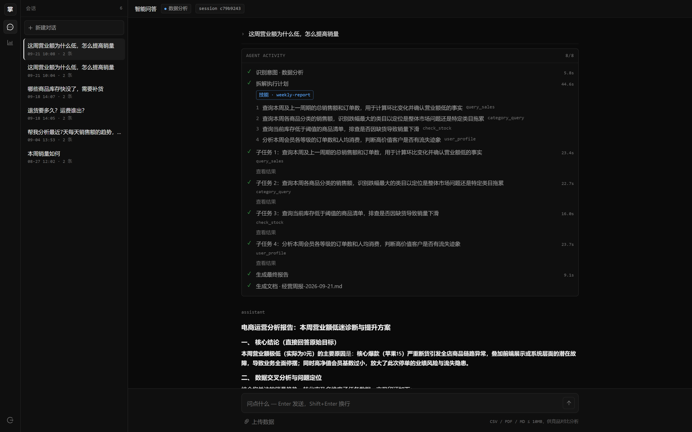
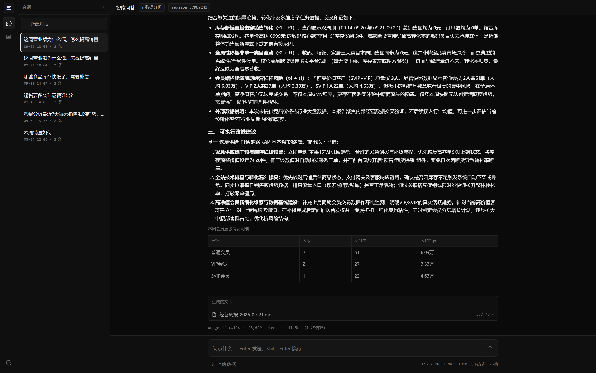

# 掌柜 · 电商运营 AI Agent

> 一个给电商运营人员用的 AI 助手：用自然语言提问，Agent 自动规划、并行调用工具查数、生成文案、检索知识库。

不是一问一答的聊天机器人，而是能**自主拆解任务、多步执行、汇总成稿**的 Agent。
从状态图引擎到 ReAct 循环、混合检索、三层记忆，**核心部件全部手写** —— 没有用 LangChain / LangGraph。

`Python 3.13` · `FastAPI` · `SQLAlchemy 2.0 (async)` · `React 19` · `TypeScript` · `SQLite` · `Qdrant` · `通义千问`



> 一次真实提问的完整轨迹：**识别意图 → 拆解成 4 个并行子任务 → 汇总成报告 → 落盘**。
> 左侧那栏是 agent 的活动时间线（8/8 步，每一步都带耗时），中途那行 `技能 · weekly-report` 是命中的技能被加载。

---

## 它能做什么

运营人员直接在聊天框里说：

```
7月15号到今天，充电宝卖了多少？
帮我生成苹果15的三条淘宝标题
退货要多久，运费谁出？
把这份周报整理成 Word 发我
```

Agent 的完整链路：

1. **意图路由** —— 判断这是数据分析 / 内容生成 / 售后问答 / 文档处理
2. **规划拆解** —— 数据分析类先拆成 2~5 个互相独立的子任务
3. **并行执行** —— 每个子任务起一个 ReAct 循环，各自调工具、看结果、再决定
4. **流式汇总** —— 边生成边推送，前端实时显示执行时间线



> 报告按 Markdown 渲染（表格、图表都能出），生成的文件直接给下载入口（还可以点开继续用），
> 底下那行 `usage 14 calls · 23,099 tokens · 141.5s` 把这一轮的成本和延迟摊开——**不放在黑盒里**。

---

## 评测结果：把"感觉变好了"变成数字

51 条**自造金标问题**（条款刻意虚构，预训练背不到，才有判别力），四路 A/B，2026-09-05：

| 检索策略 | Recall@5 | Hit@1 | MRR |
|---|---|---|---|
| BM25 单跑 | 96% | 73% | .819 |
| 向量单跑 | 63% | **51%** | .565 |
| 混合（RRF 融合） | 100% | 82% | .894 |
| **混合 + Cross-Encoder 精排**（生产路径） | **100%** | **90%** | **.942** |

三个结论：

- **向量单跑最弱**（Hit@1 只有 51%）—— 条款、数值这类精确问法，BM25 反而更强。单路各有盲区，这才是做混合的动机，不是玄学。
- **RRF 把全召回救回来** —— 它不比较分数绝对值、只比排名位次，两路谁对都救得回，1+1 > 2。
- **精排的增益大于盲目加召回** —— Hit@1 从 82% 抬到 90%，生产路径 51/51 全对。

> **前提是切分粒度，这点比数字本身重要**：最初的粗切块（全文只切 7 块）下，四路策略**全是满分**——那是被"喂到嘴边"的假象。细切成 32 块后差异才显出来。
> **尺子不准，测出来的数就是自欺。**

另有生成层（换值 / 清空 + LLM judge 判忠实度）与编排层（15 条金标用例、6 组指标）的评测尺子，见 [11 测试与评测](docs/11-测试与评测.md)。

---

## 核心特性

| 特性 | 说明 |
|---|---|
| **自研状态图引擎** | 48 行的 `AgentGraph`：节点 + 条件边路由，支持同步/异步节点 |
| **多 Agent 编排** | supervisor 8 节点 / 2 普通边 / 2 条件边；子任务 `asyncio.gather` 并行，**一格失败不拖垮整轮** |
| **ReAct 循环** | Function Calling 驱动的「想 → 调 → 看 → 再想」，带单轮预算熔断 |
| **技能层** | 流程知识渐进披露：元数据常驻、正文命中才加载；技能决定工具范围与是否落盘 |
| **混合检索 RAG** | 结构化切块 + BM25/向量双路召回 + RRF 融合 + Cross-Encoder 精排（Hit@1 82% → 90%） |
| **三层记忆** | 会话历史 / 语义画像（增量合并）/ 情景记忆（TTL），召回按 相似度 × 重要性 × 新鲜度 加权 |
| **SSE 流式** | 生产者-消费者分离，前端按事件驱动执行时间线，支持流式渲染图表 |
| **多租户隔离** | JWT + bcrypt；SQLite 按 `user_id` 过滤 · Qdrant 用 Filter · 文件按目录，三层都隔 |

---

## 为什么手写，而不用 LangChain / LangGraph

坦白说，动机是学习。我先用 LangChain / LangGraph 做过一个 Agent demo：**能跑，但说不清**这个循环到底转了几圈、条件边凭什么这样走——细节都被框架藏在里面了。

所以这个项目刻意不用编排框架，把这几样从头写了一遍：

| 手写的东西 | 换来了什么 |
|---|---|
| 48 行的 `AgentGraph` | 条件边路由、终止条件、同步/异步节点调度——全在 48 行里看得见 |
| ReAct 循环 | 「想 → 调 → 看 → 再想」，以及**什么时候该停**（单轮预算熔断） |
| 混合检索 | 切块、双路召回、RRF 融合、重排，每一环都能单独拉出来评测 |
| 记忆合并 | 语义画像增量合并、双存储对账 |

代价是有几个轮子造得不如现成的圆。但**每一步为什么这么设计我都答得上来**，而且换模型、调检索、加节点完全可控。

---

## 架构

```
用户（运营人员）
    │  自然语言提问
    ▼
[前端] React + TS + antd —— 聊天流 · 执行时间线 · 图表 · 多会话
    │  HTTP / SSE
    ▼
[API 层] FastAPI —— JWT 认证 · SSE 流式推送 · 请求日志/异常兜底
    │
    ▼
[编排层] supervisor —— 自研 AgentGraph 状态图（intent → 条件边路由）
    │
    ├─ analysis : planner → executor×N（并行 ReAct）→ synthesizer → save*
    ├─ content  : 内容 Agent（ReAct：标题 / 文案）
    ├─ service  : 客服 Agent（ReAct：查知识库）
    └─ document : 文档 Agent（ReAct：解析 / 生成落盘）
    │
    ▼
[工具层] 10 个工具 ──→ SQLite · Qdrant · LLM
    │
    ▼
[LLM 层] 通义千问（BaseLLM 抽象 + 预算装饰器，可切换）
```

> `save*` 是可选后置节点：命中的技能在 front-matter 里声明了 `save:`（如经营周报）才会走，负责把报告落盘成文件。
> **为什么是独立节点而不是给 executor 放开权限** —— 因为 `scopes` 管"谁有权调"，管不了"东西还没生成"，见 [05 章 6.4](docs/05-多Agent编排.md)。

**三层依赖**是这个项目的骨架：

```
Tool 层   ← Function Calling 的"手" —— 执行具体操作
Agent 层  ← 编排 + 决策的"大脑" —— 决定派给谁、调什么、调几次
LLM 层    ← 思考的"发动机" —— 提供智能
```

---

## 快速开始

**环境要求**：Python ≥ 3.13、[uv](https://docs.astral.sh/uv/)、Node.js ≥ 18。
向量库用 Qdrant 本地文件模式（数据落在 `qdrant_data/`），**不需要额外起服务**。

```bash
# 1. 安装后端依赖
uv sync

# 2. 配置环境变量：复制模板后填入真实值
cp .env.example .env
#   必填：DASHSCOPE_API_KEY（通义千问 API Key）、JWT_SECRET_KEY（随机字符串）

# 3. 初始化数据库 + 灌入模拟数据
uv run python -m scripts.init_db
uv run python -m scripts.seed_data

# 4. 构建知识库（解析 docs → 切块 → 向量化 → 入库）
uv run python -m scripts.build_kb

# 5. 启动后端（http://localhost:8000，自带 Swagger）
uv run uvicorn backend.api.app:app --reload --port 8000

# 6. 启动前端（另开一个终端）
cd frontend && npm install && npm run dev   # http://localhost:3000
```

> 脚本一律用 `python -m scripts.xxx` 而不是 `python scripts/xxx.py`：
> 后者会把 `scripts/` 而不是项目根目录放进 `sys.path`，`import backend` 会直接报
> `ModuleNotFoundError`。用 `-m` 或以 `PYTHONPATH=. python scripts/xxx.py` 运行都可以。

> ⚠️ 第 2 步的 `DASHSCOPE_API_KEY` 是**按量计费**的，跑起来会产生真实调用费用。

打开 http://localhost:3000，注册一个账号即可开始对话。

---

## 项目结构

```
backend/
  core/            # 基础设施：配置、LLM 抽象、AgentGraph、记忆存储、安全
  agents/          # supervisor 编排 + 意图分类 + planner/executor/synthesizer
  tools/           # 10 个工具，按 data / content / service / document 四类分组
  skills/          # 技能文档（Markdown + front matter），渐进披露加载
  infrastructure/  # 向量库、文档解析、混合检索
  api/             # FastAPI 路由、依赖注入、中间件
  db/              # SQLAlchemy 异步模型
frontend/          # React + TypeScript + antd 聊天界面
scripts/           # 初始化、灌数据、建库、评测、冒烟脚本
tests/             # 150 个 pytest 用例
docs/              # 教程式项目文档（见下）
```

---

## 测试与评测

```bash
uv run pytest                          # 150 个用例
uv run python -m scripts.rag_eval      # 检索层评测：Recall@5 / Hit@1 / MRR
```

测试全部**离线可跑**——LLM 走一个 `FakeLLM` 替身（脚本化响应 + 调用记录），不烧 token、不依赖网络。

`scripts/` 下另有 `agent_eval.py`、`rag_quality_eval.py`、`rag_answer_eval.py`，
以及一组 `smoke_*` / `verify_*` 冒烟与验证脚本。四类东西别混着用，区分方式见 [11 章第一节](docs/11-测试与评测.md)。

---

## 文档

`docs/` 下是一套**从零做到一**的教程，按实现顺序排列，每章结尾指向下一章：

| 章节 | 内容 |
|---|---|
| [00 项目概述](docs/00-项目概述.md) | 项目是什么、技术选型、整体架构 |
| [01 LLM 抽象层](docs/01-LLM抽象层.md) | 依赖倒置 + 工厂模式，模型可切换 |
| [02 工具系统](docs/02-工具系统.md) | 说明书 / 本体 / 契约层 + 角色级隔离 |
| [03 数据库设计](docs/03-数据库设计.md) | 9 张表 + 金额存分不存元 + 异步 ORM |
| [04 Agent 引擎](docs/04-Agent引擎.md) | 48 行状态图 + ReAct 循环 |
| [05 多 Agent 编排](docs/05-多Agent编排.md) | supervisor 路由 + 并行执行 + 技能层 + 落盘 |
| [06 混合检索 RAG](docs/06-混合检索RAG.md) | 结构化切块 + BM25/向量/RRF + 重排 |
| [07 记忆系统](docs/07-记忆系统.md) | 三层记忆 + 增量合并 + 双存储对账 |
| [08 API 与认证](docs/08-API与认证.md) | JWT + 依赖注入 + SSE 流式 |
| [09 前端与总结](docs/09-前端与总结.md) | 事件流 → 执行时间线 + 五条主线总结 |

再往下是三个专题，不属主线，可以当单独的册子翻：

| 章节 | 内容 |
|---|---|
| [10 踩坑总结](docs/10-踩坑总结.md) | 全项目真实踩过的坑 + 面试速记 |
| [11 测试与评测](docs/11-测试与评测.md) | 150 项离线用例 + 五把评测尺子 |
| [12 RAG 评测四层叙事](docs/12-RAG评测四层叙事.md) | 切分 / 检索 / 生成怎么讲成一条线 |

> [00 项目概述](docs/00-项目概述.md) 里有 `docs/` 全量导航（含面试准备类材料）。

---

## 技术栈

| 层级 | 技术 |
|---|---|
| 后端 | FastAPI · Uvicorn · SQLAlchemy 2.0（async） · SQLite |
| LLM | 通义千问 DashScope（`BaseLLM` 抽象，可切 OpenAI 兼容接口） |
| 检索 | Qdrant（本地模式） · rank-bm25 · text-embedding-v3 · gte-rerank-v2 |
| 前端 | React 19 · TypeScript · Vite · Ant Design · @ant-design/plots |
| 认证 | JWT（PyJWT）+ bcrypt |
| 测试 | pytest · pytest-asyncio |

---

## 说明

这是一个**个人学习与求职项目**：目的是把「Agent 到底怎么跑起来的」这件事从底层实现一遍，
所以刻意避开了现成编排框架，把状态图、ReAct 循环、混合检索、记忆合并这些都自己写了一遍。
`docs/` 里记录的每一个坑都是真实踩过的，不是转述。
